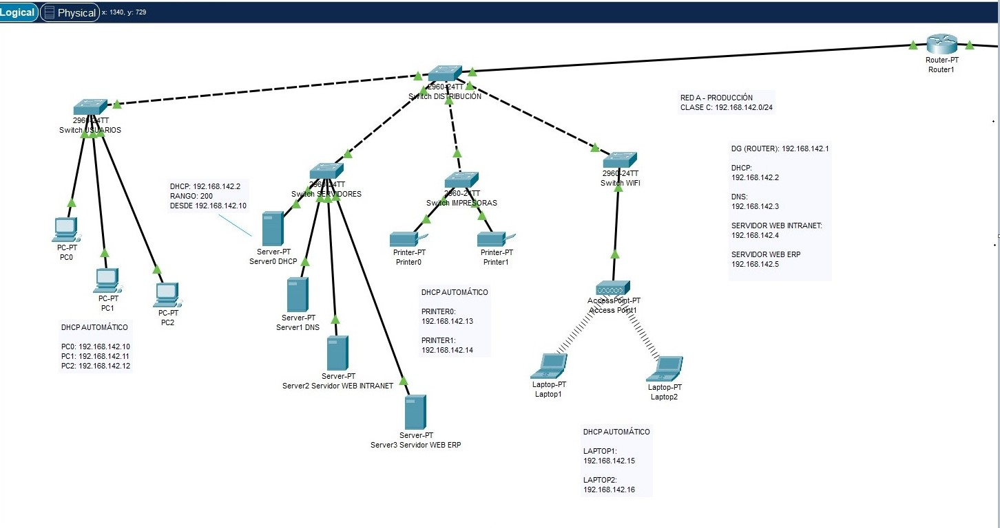
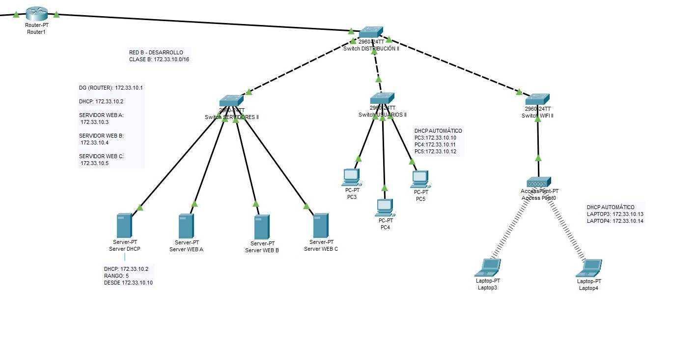

# Network Design Basics

Este proyecto simula el diseño de dos redes empresariales (Producción y Desarrollo) usando Cisco Packet Tracer. Fue originalmente desarrollado como parte de un examen práctico en 2021, y se reutiliza como portafolio técnico para cursos de ciberseguridad y certificaciones Cisco.

## 🔍 Objetivos

- Simular entornos empresariales reales sin VLANs
- Aplicar conceptos de direccionamiento IP, DHCP, DNS y servidores web
- Documentar topologías y configuraciones para uso educativo y profesional

## 🧱 Estructura del proyecto

- `diagrams/`: Diagramas visuales en formato draw.io
- `docs/`: Documentación técnica en PDF
- `packet-tracer/`: Archivo `.pkt` de Cisco Packet Tracer

## 🖧 Redes simuladas

### RED A - Producción
- Clase C: `192.168.142.0/24`
- Router: `192.168.142.1`
- DHCP: `192.168.142.2`
- DNS: `192.168.142.3`
- Servidores web: `192.168.142.4` (Intranet), `192.168.142.5` (ERP)

### RED B - Desarrollo
- Clase B: `172.33.10.0/16`
- Router: `172.33.10.1`
- DHCP: `172.33.10.2`
- Servidores web: `172.33.10.3`, `.4`, `.5`

## 🖼️ Diagramas visuales

### Red A - Producción

### Red B - Desarrollo

### Diagrama editable (.drawio)

[Descargar diagrama de Red A y Red B](diagrams/red-a-red-b.drawio)

## 📄 Documentación técnica

[📥 Descargar PDF de configuración](docs/configuracion-red-a-b.pdf)

## 🧪 Simulación en Cisco Packet Tracer

[📥 Descargar archivo .pkt](packet-tracer/red-a-red-b.pkt)

## 🛠️ Tecnologías utilizadas

- Cisco Packet Tracer
- draw.io
- Redes IP (DHCP, DNS, Web)
- Windows (estructura de carpetas y documentación)

## 📚 Aplicación en ciberseguridad

Este diseño sirve como base para:
- Simulaciones de ataques y defensas en redes segmentadas
- Prácticas de configuración segura de servicios
- Laboratorios de análisis de tráfico y detección de anomalías

## 📅 Año original: 2021 | Reutilizado: 2026

